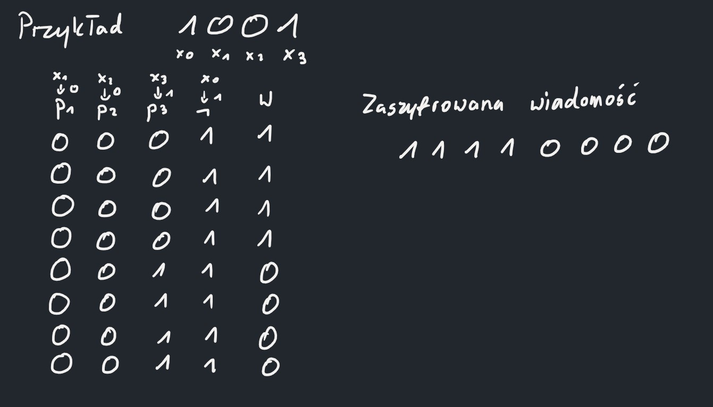
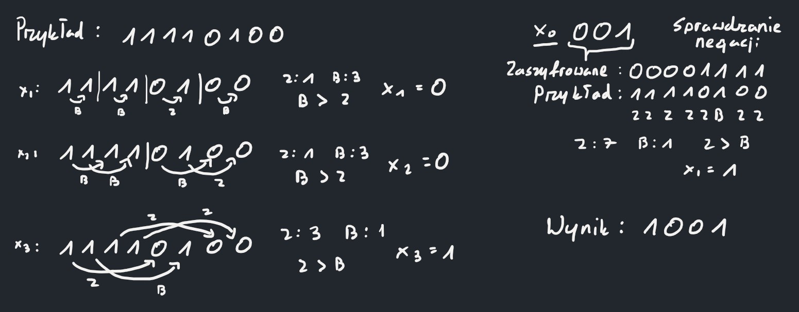

## Dane
- N+1 - ilość bitów oryginalnej wiadomości
- x0, ..., xN - bity oryginalnej wiadomości
- 2N - ilość bitów zaszyfrowanej wiadomości
- a - dowolna liczba w zbiorze {1, ..., N}

## Szyfrowanie wiadomości
Formułę logiczną kodującą wiadomość można uprościć do parzystości 1 w wartościowaniu.
Gdy ilość jest parzysta, wtedy wynik wartościowania to 0, gdy nieparzysta - 1.
(Wynika to z działania operatora XOR. Parzysta ilość prawd -> 0, nieparzysta -> 1).
Następnie wynik poddawany jest negacji, jeżeli wartość bitu x0 = 1, natomiast dla wartości 0 wynik
pozostaje bez zmian. Każdy bit x1, ..., xN pokazuje czy dana kolumna p1, ..., pN 
będzie miała bity 1 i 0, (pa = 1), czy wszystkie jedynki zostaną wyzerowane (pa = 0).

## Odszyfrowywanie wiadomości
Każdy bit wyniku x1, ..., xN da się odszyfrować poprzez porównywanie odpowiadających sobie 
wartościowań, które zmienia co najwyżej dana kolumna[1]. Gdy następuje więcej zmian bitów w odpowiadających sobie parach, to wartość xa 
jest równa 1, w przeciwnym wypadku 0. Negację natomiast da się określić poprzez odwrócenie bitów 1 na 0 dla każdego wartościowania 
i porównanie czy ilość bitów 0 jest większa niż 1, wtedy x0 = 0. Gdy ilość 1 jest większa od 0, to x0 = 1.
Negację można również określić poprzez zaszyfrowanie odkodowanej wiadomości bez negacji i porównanie czy liczba niezmienionych 
bitów jest większa od zmienionych (W ten sposób działa algorytm w pliku *main.py*).

#### [1] Porównywanie bitów
Pary do porównania bitów określa się według następującego schematu (w zapisie binarnym kolejnych liczb 
istnieją 2 liczby różniące się 1 bitem):\
Dla każdego xa dzielimy zaszyfrowaną wiadomość na bloki długości 2a = d, w których porównujemy bity 
b0, ..., bd następująco:\
b0 - bd/2+1, b1 - bd/2+2, ..., bd/2 - bd

## Maksymalna ilość zniekształconych bitów
Maksymalnie wiadomość może mieć zmienione 2N-2-1 bitów. Wtedy mamy pewność, że nierówność przy ilości par 
bitów zmienionych i niezmienionych będzie taka sama jak w oryginalniej wiadomości (Już przy zmianie 2N-2 bitów 
natrafiamy na przypadek gdzie ilość par zmienionych i nie są sobie równe. Wtedy nie możemy określić, która wersja była 
oryginalnie zakodowana.)